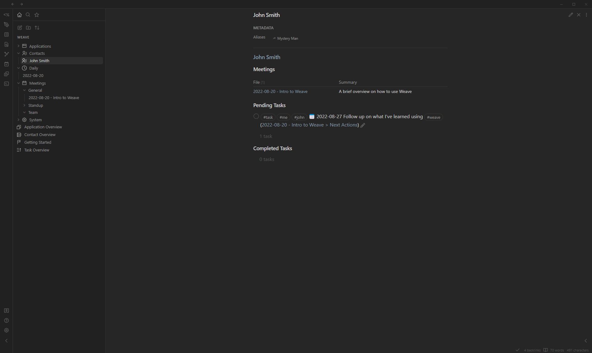
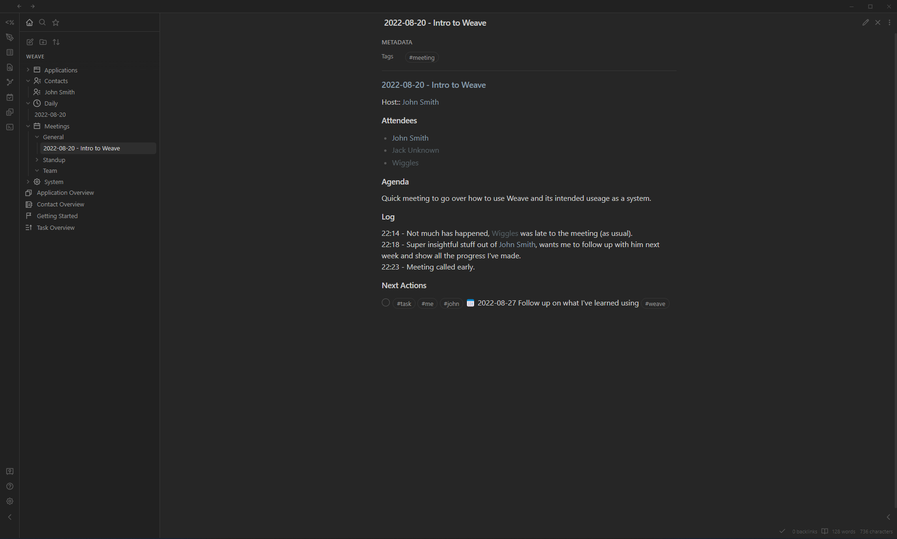
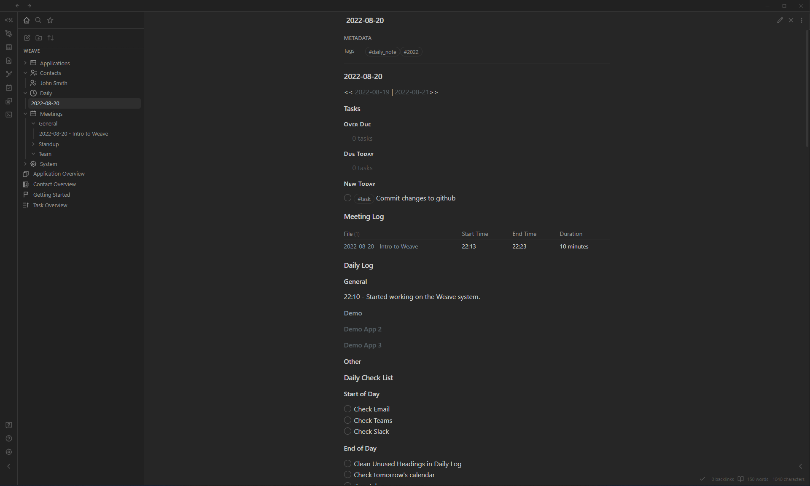
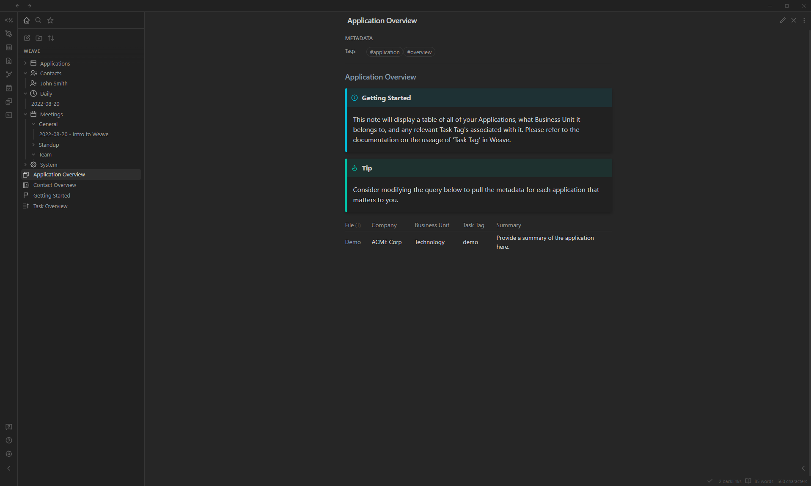

# Weave
A highly opinionated Obsidian vault template for Software Developers/Managers to get you productive fast. Heavy focus on bringing order out of chaos in the corporate world. Track your meetings, applications, contacts, and tasks and draw connections between all of them.

## Features

- Divies your work stream into `Applications`, `Contacts`, `Daily Journals` and `Meetings`.
- DataView links between all above entities to help you draw insights from your day to day activites.
- TaskViews with a heavy dependency on tags to help you organize your actions and follow ups.
- Inline Regex Script to make entry easier.
  - **NEW** If you use github issues or ado work items for your agile backlog, you can now do `;;ado <Work Item Number>::` to have a direct link to your work item entry added, or `;;ghi <Issue Number>::` to have a link to the github issue.
- Hotkeys to help speed up workflow
  - Try `Cntrl(Cmd) + Shift + Alt + T` from anywhere in the vault to add a task to your current daily file
  - Try `Cntrl(Cmd) + Shift + T` to add the current time stamp to your cursor position (helpful for your journal logs)
- QuickAdd actions for all major entities above
    
## Prerelease available!
Check out the [Releases](https://github.com/cuken/obsidian-weave/releases) section and download either the `Demo` or `Clean` version of Weave. Demo includes a Getting started guide as well as some sample data to show all the pieces working together.

## Feedback Please!
Weave is something I wanted to give back to the community, pulling inspiration from many others before me. (I need to add a credit section soon...). Any and all Feedback would be greatly appreciated as there is always room to improve the system.

## Feature Requests
If you would like to see something added to Weave, please create an Issue and outline what it is you need.

## RoadMap
**COMING SOON**

## Screenshots

